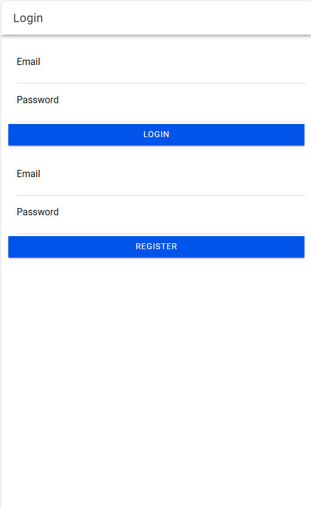
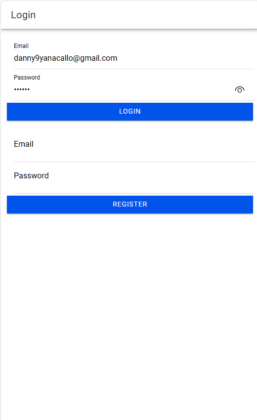
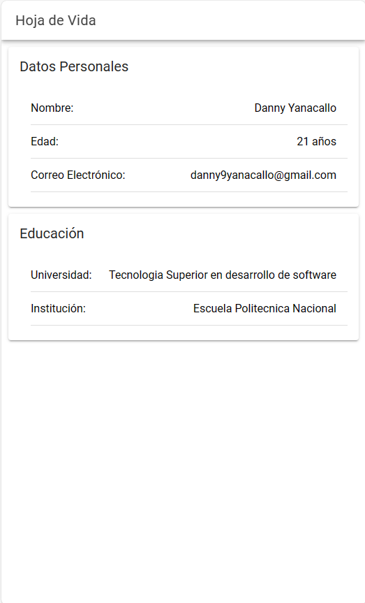
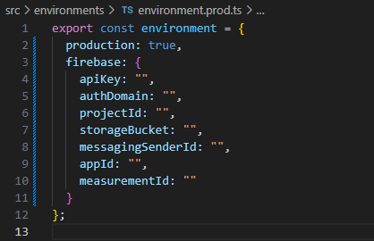

# Desarrollo de un login con firebase
## Integrantes:
- Danny Yanacallo
### Instrucciones
Implementar un login con firebase y generar la apk.

La aplicación debe tener un splash screen con su foto y la primera pantalla debe mostrar su cv.
  

## Capturas

## Como funciona

Primero tenemos que tener bien configurado el apartado environments para que no se produzca ningun error al momento de la verificacion de credenciales

